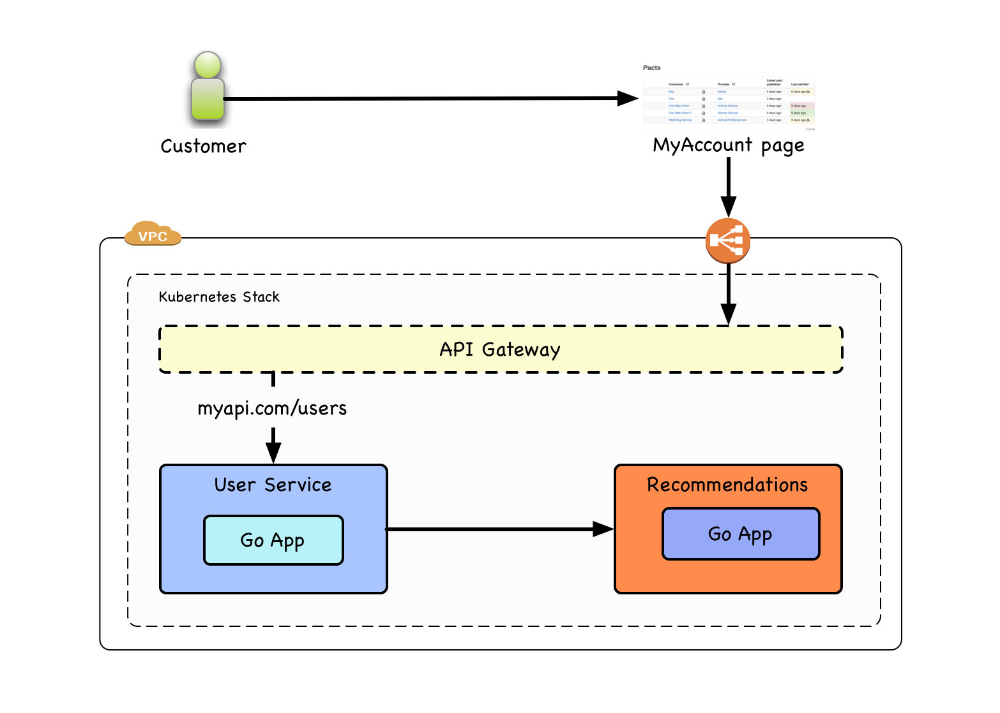
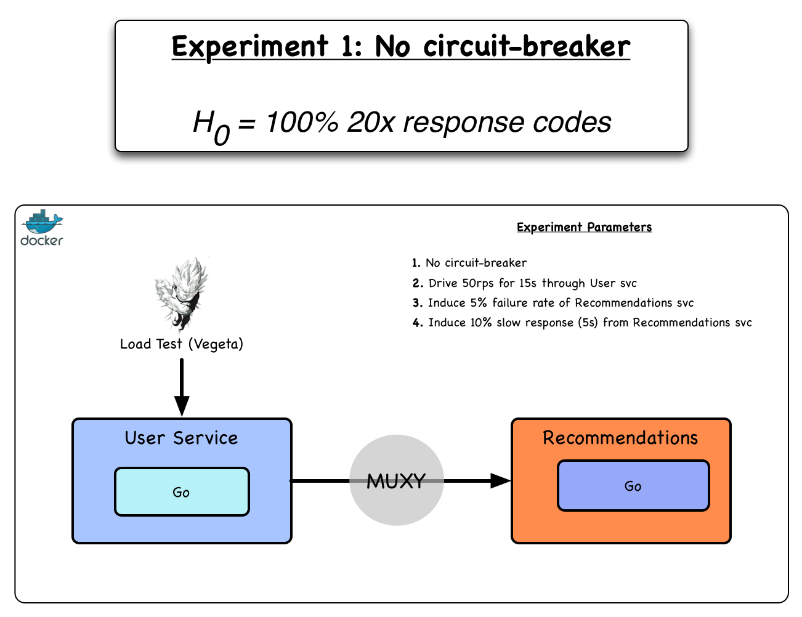
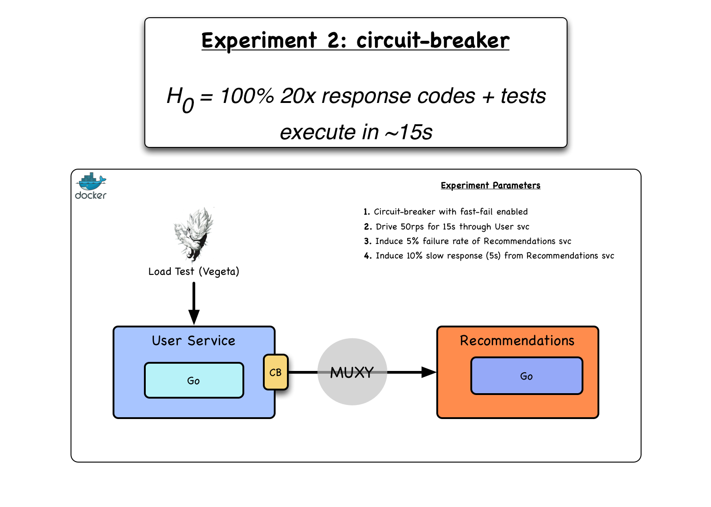
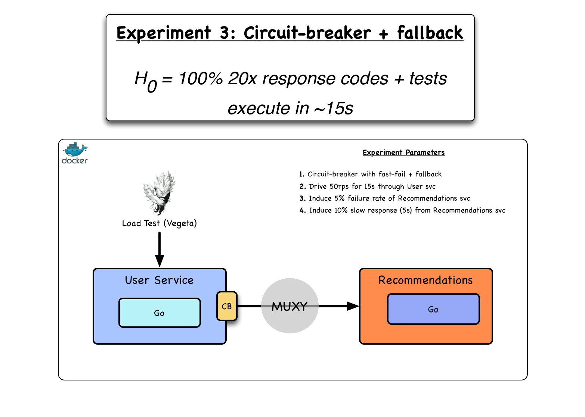
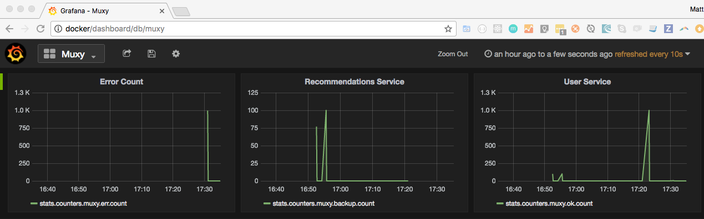

# GameDay - achieving resilience through chaos engineering

A set of simple chaos engineering experiments to demonstrate the value and simplicity of chaos engineering.

These experiments are a part of set of [resources](dius.com.au/resources/game-day/) that accompany our 
talk from Agile Australia (agileaustralia.com.au/2017/sessions/#pete-and-matt) in 2017.

You can also see our talk [slides](https://www.slideshare.net/DiUSComputing/gameday-achieving-resilience-through-chaos-engineering/)
and soon, our GameDay video.

Watch a video demonstrating [](http://www.youtube.com/watch?v=T-DtbA9W9TS3s), 
using the code in this repository.

## Getting started

* A local installation of [Docker](https://www.docker.com/) and [Docker Compose](https://docs.docker.com/compose/install/)

From hereon, we will refer to the docker host as `docker`. You should create a local host entry for docker pointing to the IP address of your docker machine:

e.g. in `/etc/hosts`:

```
docker 192.168.0.100
```

_NOTE_: Only tested onMac OSX and Linux variants.

### Optional Tools

If you want to test these items manually and outside of Docker, you'll need:

* An installation of Go 
* [Muxy](https://github.com/mefellows/muxy/) for failure injection
* [Vegeta](https://github.com/tsenart/vegeta) for load testing

## Overview of the setup

We shall be testing the following fictional architecture, focussing on the "User Service"
and "Recommendations Service":



It involves a Docker Compose setup that has a `test harness (muxy_test.go) + load test (vegeta)` -> send tests to `frontend API` <- issues requests via Muxy (injects failure) -> `backend API`.

In the event that:

1. The API returns an error (40x, 50x response code)
1. The API is inaccessible
1. The API does not meet its defined SLAs (currently a generous 1500ms)

The Test Harness will detect the failure and the container will exit with a non-zero status code, 
meaning our system needs to improve.

Each experiment will attempt to improve on the behaviour of the architecture.

### Repository layout

```
├── Dockerfile         # Muxy docker image
├── api                # Front-end Golang "User Service"
│   ├── Dockerfile
│   └── main.go
├── backend            # Back-end Golang "Recommendations Service"
│   ├── Dockerfile
│   └── main.go
├── docker-compose.yml # Experiment infrastructure setup
├── muxy               # Muxy config files + test harnes
│   ├── Dockerfile     # Runs muxy_test.go, the exp
│   ├── conf
│   ├── main.go
│   └── muxy_test.go   # The test harness to ensure 20x response codes
├── run-chaos.sh       # The script to run the setup
└── sgg                # Contais the Statsd, Graphite and Grafana infra
    ├── Dockerfile
```

## Running the experiments

Each experiment is stored in it's own branch, and can be run with `./run-chaos.sh`

### Experiment 1



```
git co experiment1
./run-chaos.sh
```

The tests should be a failure, as demonstrated by the `gamedayresources_test_1` output:

```
test_1             | 	muxy_test.go:50: Expected 200 response code, but got 503
test_1             | 	muxy_test.go:50: Expected 200 response code, but got 503
test_1             | 	muxy_test.go:50: Expected 200 response code, but got 503
test_1             | 	muxy_test.go:50: Expected 200 response code, but got 503
test_1             | FAIL
test_1             | exit status 1
test_1             | FAIL	_/app	5.965s
gamedayresources_test_1 exited with code 1
....
vegeta_1           | Requests      [total, rate]            750, 50.07
vegeta_1           | Duration      [total, attack, wait]    19.981740988s, 14.979999791s, 1.741197ms
vegeta_1           | Latencies     [mean, 50, 95, 99, max]  3.595773ms, 1.665649ms, 6.091287ms, 46.085067ms, 183.416853ms
vegeta_1           | Bytes In      [total, mean]            323, 0.43
vegeta_1           | Bytes Out     [total, mean]            0, 0.00
vegeta_1           | Success       [ratio]                  95.60%
vegeta_1           | Status Codes  [code:count]             200:717 503:33
vegeta_1           | Error Set:
vegeta_1           | 503 Service Unavailable
```

As you can see, we only have a 95% success rate and the tests take ~20s to run, which is 5 more than intended.

Hit `cntl-c` when you're ready for the next step.

### Experiment 2



In this step, we add two new innovations. 

1. We instrument the APIs with Statsd metrics (see sections below) to give us visibility into system performance
1. We add a [circuit breaker](https://github.com/afex/hystrix-go) to add latency and fault-tolerance to the API

```
git co experiment2
./run-chaos.sh
```

This test should still fail, but it should take approximately 15s as now we are failing fast if the circuit is open:

```
test_1             | 	muxy_test.go:50: Expected 200 response code, but got 503
test_1             | 	muxy_test.go:50: Expected 200 response code, but got 503
test_1             | 	muxy_test.go:50: Expected 200 response code, but got 503
test_1             | 	muxy_test.go:50: Expected 200 response code, but got 503
test_1             | FAIL
test_1             | exit status 1
test_1             | FAIL	_/app	3.965s
gamedayresources_test_1 exited with code 1
....
vegeta_1           | Requests      [total, rate]            750, 50.07
vegeta_1           | Duration      [total, attack, wait]    14.981740988s, 14.979999791s, 1.741197ms
vegeta_1           | Latencies     [mean, 50, 95, 99, max]  3.595773ms, 1.665649ms, 6.091287ms, 46.085067ms, 183.416853ms
vegeta_1           | Bytes In      [total, mean]            323, 0.43
vegeta_1           | Bytes Out     [total, mean]            0, 0.00
vegeta_1           | Success       [ratio]                  95.60%
vegeta_1           | Status Codes  [code:count]             200:717 503:33
vegeta_1           | Error Set:
vegeta_1           | 503 Service Unavailable
gamedayresources_vegeta_1 exited with code 0
```

### Experiment 3



```
git co experiment3
./run-chaos.sh
```

This test should pass, as now the API will always respond with a 200, even if the backend is down.

You should see something like the below in your terminal:

```
test_1             | Response:
test_1             | Call from backup function
test_1             | Call from backup function
test_1             | --- PASS: Test_Example1000calls (4.69s)
test_1             | PASS
test_1             | ok  	_/app	4.703s
gamedayresources_test_1 exited with code 0
...
vegeta_1           | Requests      [total, rate]            750, 50.07
vegeta_1           | Duration      [total, attack, wait]    14.981356728s, 14.979999806s, 1.356922ms
vegeta_1           | Latencies     [mean, 50, 95, 99, max]  4.790972ms, 1.590297ms, 6.194134ms, 118.380217ms, 183.775359ms
vegeta_1           | Bytes In      [total, mean]            18288, 24.38
vegeta_1           | Bytes Out     [total, mean]            0, 0.00
vegeta_1           | Success       [ratio]                  100.00%
vegeta_1           | Status Codes  [code:count]             200:750
vegeta_1           | Error Set:
gamedayresources_vegeta_1 exited with code 0
```

## Accessing the dashboards

From experiment 2 onwards, we add [statsd](https://github.com/etsy/statsd) metrics visualised with [Grafana](https://grafana.com/) and [Hystrix](https://github.com/Netflix/Hystrix) circuit breakers to the system,
visualised by their [dashboards](https://github.com/Netflix/Hystrix/wiki/Dashboard):

### [Grafana dashboard](http://docker/dashboard/db/muxy)

Grafana gives us near real-time insight into which parts of the system are actively serving requests. 
This allows us to see how often traffic is making it to the backend servers, if the backup function is being called or if we are fast failing.



### [Hystrix dashboard](http://docker:7979/hystrix-dashboard/monitor/monitor.html?streams=%5B%7B%22name%22%3A%22Test%22%2C%22stream%22%3A%22http%3A%2F%2Fapi%3A8181%22%2C%22auth%22%3A%22%22%2C%22delay%22%3A%22%22%7D%5D)

You can see the behaviour of the circuit breaker as it opens and closes throughout time.


## Run manually (without Docker)

First, run `./run-chaos.sh` so that you have a running SGG and Hystrix dashboard on your docker host.

Then, in run each of the following in separate tabs. We use environment variables to configure the hosts each component is configured to connect with:

```
cd api && API_HOST=http://localhost:8001 PORT=8000 STATSD_HOST=192.168.99.100:8125 go run main.go
muxy proxy --config muxy/conf/config.local.yml
cd backup && PORT=8002 STATSD_HOST=192.168.99.100:8125 go run main.go
time echo "GET http://localhost:8000/" | vegeta attack -duration=15s | tee results.bin | vegeta report
```

### Local Hystrix Dashboard

### Local API

Grab your own IP address (e.g. 192.168.0.7) and pop it into the url as per below:

http://docker:7979/hystrix-dashboard/monitor/monitor.html?streams=%5B%7B%22name%22%3A%22Test%22%2C%22stream%22%3A%22http%3A%2F%2F192.168.0.7%3A8181%22%2C%22auth%22%3A%22%22%2C%22delay%22%3A%22%22%7D%5D